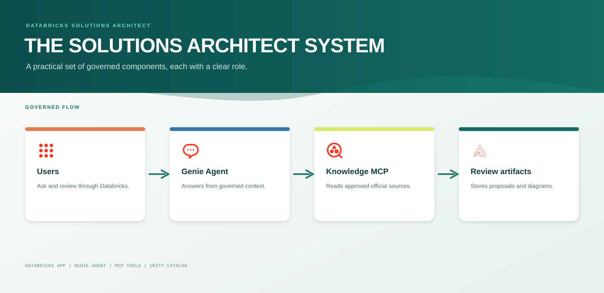
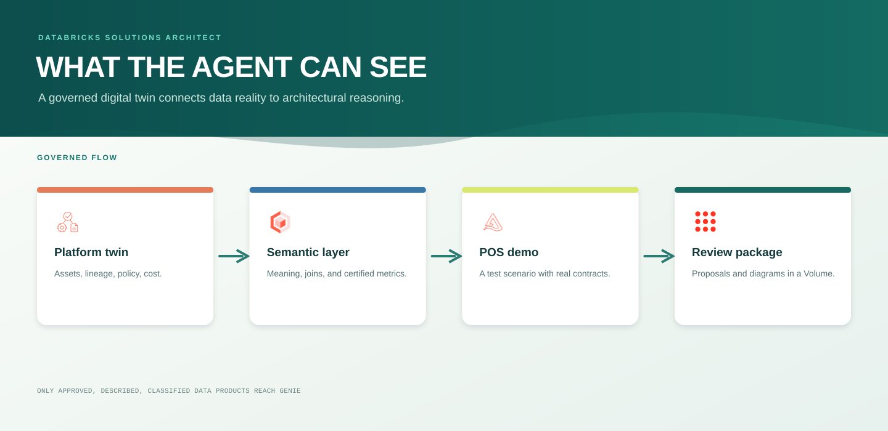
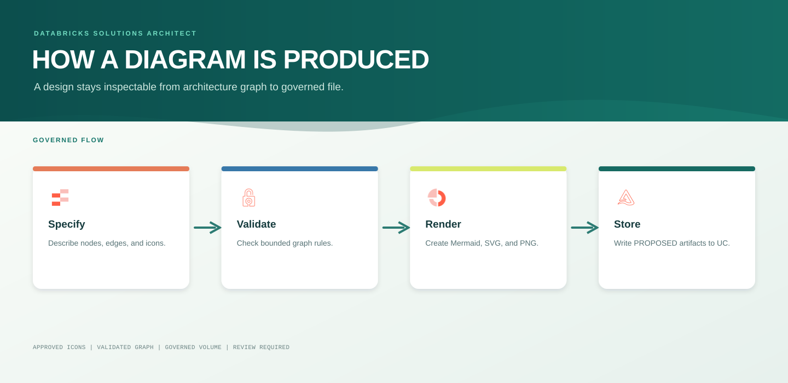

# System Architecture

## Product intent

The Databricks Solutions Architect is an architecture analysis and planning system. Solutions architecture connects a business need to a feasible technical design across data, AI, applications, governance, operating ownership, cost, migration, and rollback. This system turns a change request into evidence-grounded options, tradeoffs, migration and rollback plans, an approval-gated proposal, and a reviewable diagram. It starts from what is actually governed in the platform instead of inventing a design from a blank page.

Its evidence has two governed lanes. The Genie Agent inspects the Unity Catalog digital twin for workspace facts. The Databricks Solutions Architect Knowledge MCP reads current public articles only from allowlisted official `docs.databricks.com` sources. Freshly retrieved articles are `CANDIDATE` evidence; only human-reviewed knowledge becomes `REVIEWED` context that supports affirmative recommendations about Databricks capabilities and best practices.

The production request executor connects these lanes to a durable review workflow. It records the complete streamed Genie response, request, conversation reference, and evidence register, then creates exactly three agent-provided option graphs. Each graph is independently validated and written as Mermaid, SVG, PNG, evidence-manifest, review HTML, and PDF artifacts in the governed Volume. The Databricks App records a selection or rejection for each option without executing infrastructure.

## Interaction model

This is the implementation-oriented version of the earlier layered design: users operate through Databricks Apps, a solutions architect executor uses the scoped Genie agent plus bounded tools, and the underlying data plane stays governed by Unity Catalog.



## Operating boundaries

| Component | Allowed action | Explicitly excluded |
| --- | --- | --- |
| Genie | Read governed data and provide cited analysis | Provisioning, permission changes, unreviewed capability claims |
| Platform refresh | Read approved Unity Catalog and System Table signals | Enabling system schemas, reading arbitrary repositories |
| Knowledge MCP | Read allowlisted official `docs.databricks.com` internet articles as candidate evidence and validate diagram specifications | Arbitrary web access, asserting candidate content as fact |
| Knowledge review | Promote a specific candidate to `REVIEWED` | Automatic approval |
| Proposal writer | Write one reviewable proposal | Applying IaC, deployment, destructive actions |
| Diagram renderer | Validate a graph and write review artifacts | External diagram APIs, provisioning |
| Request executor | Create one proposal, full Genie response record, evidence trail, and three option-specific diagrams | Auto-approval or infrastructure execution |
| Review package generator | Render stored architecture SVG into a PDF package | Replacing the governed evidence manifest |
| App approval UI | Record a reasoned decision per option under the reviewer's OBO identity; archive unselected options | Executing the approved design |

## Current governed resources



## Diagram artifact flow



The icon archive supplied for this project is stored at:

```text
/Volumes/databricks_architect_agent/agent_demo/architecture_icons/databricks-architecture-icons-all.zip
```

The renderer extracts and embeds only requested valid icon names from this governed source, such as `auto-loader`, `delta-lake`, `ai-search`, and `ai-bi-dashboards`.

The dedicated hybrid Delta Sync index `databricks_architect_agent.agent_demo.reviewed_architecture_knowledge` runs on `solutions-architect-knowledge-vs`. It synchronizes the Change-Data-Feed-enabled knowledge chunk table using `databricks-gte-large-en` embeddings. Its initial provisioning state must become ready before the executor can use it for semantic retrieval.