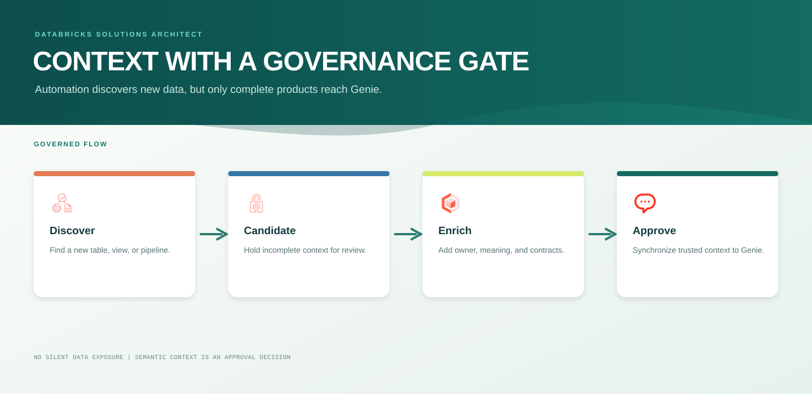
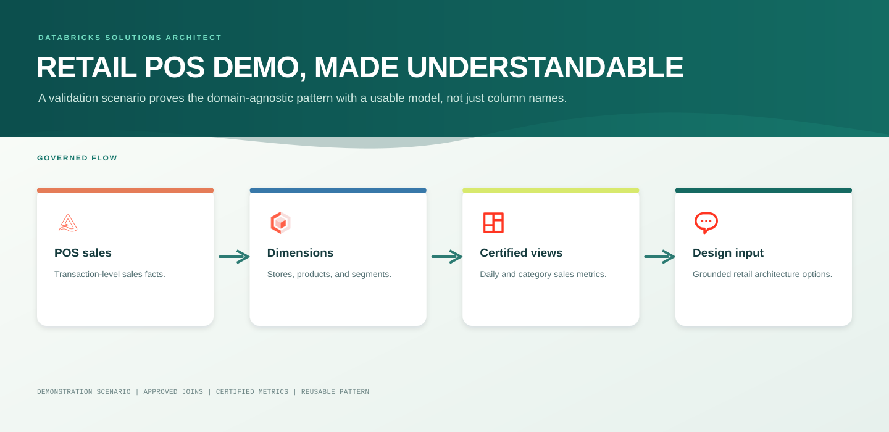
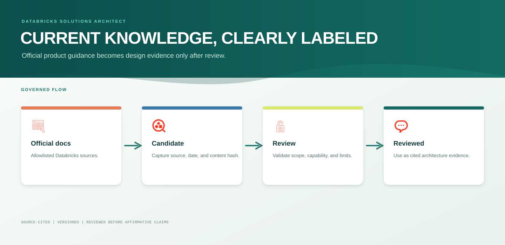

# Semantic Control Loop

Genie should never receive every new table automatically. A raw object name is not enough for architectural reasoning, and unclassified objects may contain sensitive data. This control loop makes context expansion automatic only after the object is governed and semantically usable.

## Required approval fields

An object is automatically eligible for Genie only when it has all of the following:

| Requirement | Governing source |
| --- | --- |
| `publication_status = APPROVED` | `semantic_data_product` |
| `genie_eligible = true` | `semantic_data_product` |
| Owner and classification | `semantic_data_product` |
| Human-readable description | Unity Catalog comment and semantic data product contract |
| Column meaning and sensitivity | `semantic_column_contract` |
| Approved relationship paths | `semantic_join_contract` where joins are needed |
| Certified calculation definitions | `semantic_metric_contract` where metrics are needed |
| Pipeline schedule, SLA, target, owner | `pipeline_contract` where operational analysis is needed |

## Retail POS demonstration workload

Retail POS is the project’s seeded demonstration and acceptance-test workload. It proves the semantic-control loop with realistic tables, joins, metrics, and an operating pipeline; it does not limit the Databricks Solutions Architect Genie Agent to retail. Additional domains follow the same approval and synchronization path.

Certified metrics are `Net Sales`, `Units Sold`, and `Gross Profit`. The workload contains non-identifying customer segments only; direct customer PII is not part of this demo data model.

## Knowledge lifecycle

The Databricks Solutions Architect Knowledge MCP is the controlled public-internet reader in this flow. It accepts only HTTPS sources hosted at `docs.databricks.com`, including official documentation and release guidance. A new or changed page is stored as `CANDIDATE` evidence with its canonical URL, retrieval time, and content hash. The scheduled knowledge workflow chunks approved source content for retrieval. A human reviewer promotes claims to `REVIEWED` before the Genie Agent can use them as affirmative Databricks architecture guidance.

The daily `dev-enterprise-architect-knowledge-stage` workflow enforces `knowledge_source_allowlist`, retrieves and versions active official sources, and writes candidate chunks to `architecture_knowledge_chunk`. The dedicated hybrid Delta Sync index `reviewed_architecture_knowledge` is provisioned over that CDF-enabled table. Retrieval clients must filter on `review_status = REVIEWED`; candidate chunks remain research material, not affirmative architecture evidence.

Changed content hashes create new versions. A reviewed recommendation must cite its canonical URL, relevant date, review state, cloud/region scope, and any known limitation.