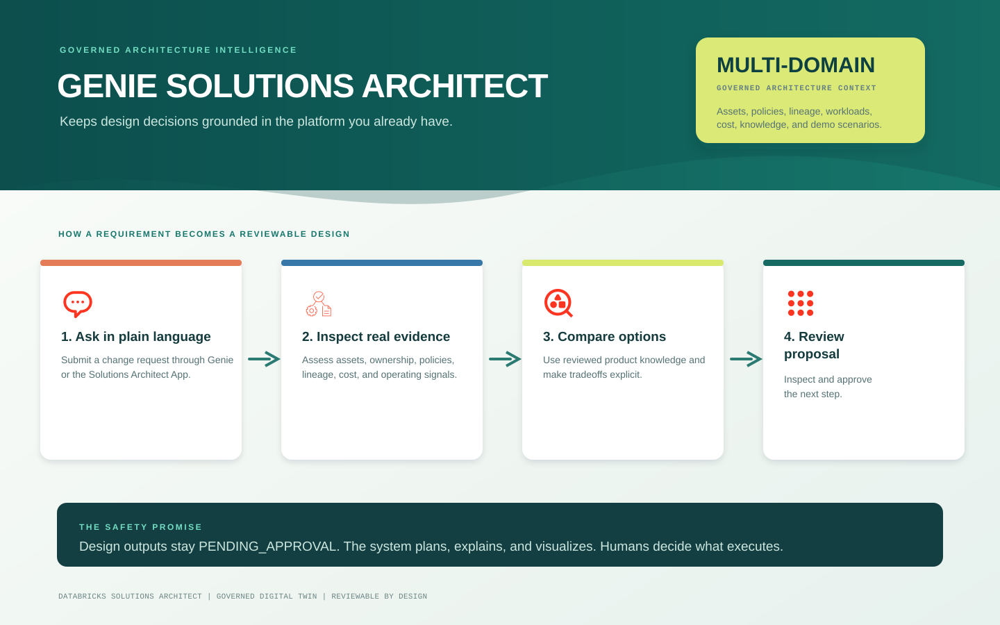
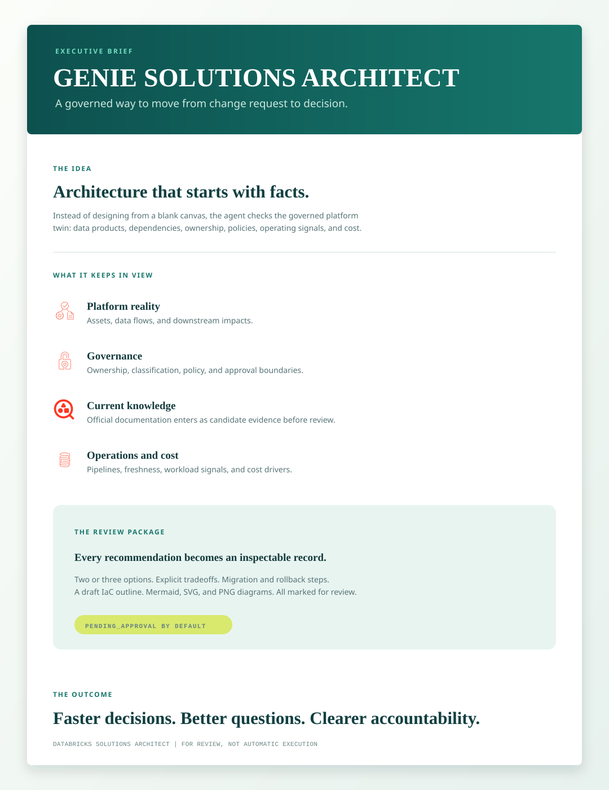
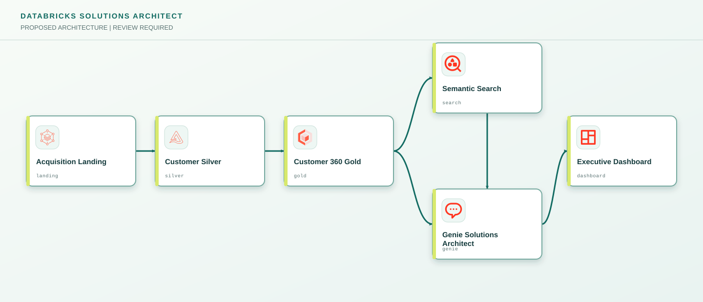

# Building a Databricks Solutions Architect Genie Agent

Most architecture work starts with a request and a blank canvas. That is fine for early brainstorming, but it becomes risky when a proposed design ignores existing data products, ownership boundaries, workload constraints, cost signals, or a downstream dashboard that somebody depends on every morning.

Databricks Solutions Architect is built to begin somewhere better: with a governed picture of the platform as it exists today. Its primary analytical experience is the **Databricks Solutions Architect Genie Agent**. The Genie Agent turns a plain-language requirement into an evidence-based architecture conversation, using the governed data products, lineage, policy, workload, cost, and semantic context attached to its Genie space.

It is not a generic chatbot and it is not an autonomous infrastructure provisioner. The Genie Agent is the governed reasoning layer: it inspects the current platform first, names the evidence it used, proposes alternatives with tradeoffs, and creates only reviewable `PENDING_APPROVAL` recommendations.



## What solutions architecture means

Solutions architecture turns a business need into a feasible technical design. It connects the desired outcome to the data, AI, applications, governance controls, operating teams, cost drivers, migration path, and rollback plan required to deliver it. A good solutions architecture is not just a diagram. It explains why an option fits the current environment, what it reuses, what it changes, what it costs, and what must be true before it can proceed.

The Databricks Solutions Architect Genie Agent applies that discipline to the governed platform twin. It can handle all approved solution-architecture scenarios: new analytics products, AI and agent capabilities, data migrations, modernization, platform consolidation, governance changes, cost and performance improvements, customer 360, operational reporting, and domain-specific change requests. For every approved domain, it connects requirements to existing assets and lineage, required Unity Catalog boundaries, appropriate serving patterns, pipeline operations, quality expectations, downstream consumers, and the people accountable for running the result.

## A design partner grounded in reality

The experience combines the Genie Agent for natural-language exploration with a Databricks App for reviewing architecture work. A user can ask the Genie Agent about a new requirement, such as onboarding an acquired company, adding near-real-time analytics, or introducing semantic search. The system checks its governed platform model first, then identifies reusable assets, policy constraints, downstream impacts, and cost signals before it recommends options.

This changes the conversation. Instead of receiving a generic target-state diagram, teams receive a design that can explain what it reuses, who owns each part, what could be affected, and what remains unknown.

## More than a list of tables

A platform inventory alone cannot answer meaningful architecture questions. The system adds a semantic layer so the agent understands what each governed object represents, how it should join to related data, which measures are certified, who owns it, and whether it is appropriate for the intended analysis.

Retail POS is the seeded **demonstration and acceptance-test scenario**, not the scope of the product. It gives the Genie Agent one concrete workload with sales facts, stores, products, non-identifying customer segments, certified sales views, approved joins, and a pipeline contract with an operating schedule and freshness expectation. The retail illustration proves the reusable pattern; it does not define the agent's use case. The same governed approach applies to finance, supply chain, customer, operations, AI workloads, or any other approved domain with ownership, classification, and semantic contracts.


## Automation with a gate, not a blindfold

New tables, views, and pipelines can appear frequently. The Solutions Architect keeps its context current through scheduled discovery and synchronization, but it does not expose every newly discovered object to Genie automatically. A new object first needs an owner, classification, useful description, and a semantic contract. Only then can it become an approved Genie data product.


That guardrail is intentional. It lets the system grow with the platform while protecting sensitive, incomplete, or poorly understood data from being treated as architecture evidence.

## Current knowledge, clearly labeled

Architecture guidance must evolve with Databricks. The project includes a dedicated **Databricks Solutions Architect Knowledge MCP** service, hosted as a Databricks App, that can read current public internet articles from the allowlisted official `docs.databricks.com` domain. It retrieves official documentation and release guidance for capabilities such as Genie, Unity Catalog, AI Search, system tables, and MCP tools. The MCP service also validates architecture-diagram specifications.

The knowledge path is deliberately governed. The MCP does not treat a freshly fetched web page as an architecture fact. It records the canonical URL, retrieval time, content hash, and source excerpt as `CANDIDATE` evidence. A scheduled knowledge workflow chunks approved sources for retrieval, and a human reviewer must promote a specific claim to `REVIEWED`. The Genie Agent uses reviewed knowledge for affirmative claims about current Databricks capabilities, availability, limitations, cloud/region scope, and recommended patterns.

The production implementation adds a dedicated hybrid Delta Sync knowledge index over the governed chunk store. It keeps retrieval current as reviewed documentation changes, while the review-state filter ensures that research candidates do not quietly become architecture facts.

The agent can therefore distinguish between three things that are often conflated: what is already available in this workspace, what current official Databricks documentation supports, and what is still an assumption requiring confirmation. This keeps recommendations current without allowing the public internet to silently override workspace evidence or governance policy.



## From recommendation to a review package

The system deliberately stops short of executing a design. It can create a proposal with options, tradeoffs, migration steps, rollback guidance, risks, and a draft IaC outline, but every proposal remains `PENDING_APPROVAL`.

The request executor makes this repeatable: it fingerprints a submitted request, reuses an existing proposal when the same request is submitted again, records the evidence register, generates the architecture artifacts, and prepares a PDF review package. The Databricks App shows the package and allows a reviewer to approve or reject it with a reason. A decision changes only the governed proposal state; it does not deploy the design.

It can also validate an architecture graph and generate Mermaid, SVG, and PNG diagram artifacts. The diagrams use approved Databricks architecture icons held in a governed Unity Catalog Volume, and the artifacts are stored beside the proposal for review.


### Example generated solution diagram

The diagram below is a real sample artifact generated by the Solutions Architect for an example Customer 360 change request: onboard acquired-company data, support near-real-time analytics, add semantic search, and preserve governed review. Customer 360 is one example scenario, not a fixed product focus. The same generator produces diagrams for any approved domain or change request using the relevant governed assets, dependencies, policies, and approved Databricks patterns.

Here is the short **user request prompt** submitted to the already-configured Solutions Architect Genie Agent. The agent's standing instructions, evidence rules, and execution boundaries are applied automatically.

```text
We acquired a company. Design a new governed solution architecture for onboarding 200 TB of acquired-company data, near-real-time Customer 360 analytics, semantic search, and low operating cost. Use our current environment and return the recommended options, a reviewable architecture diagram, and the evidence used.
```

The short request above is interpreted through the following **configured Genie Agent instruction**. This is configured once for the Genie Agent; it is not pasted by the user for each request.

```text
You are the Databricks Solutions Architect Genie Agent.

Inspect the governed Unity Catalog platform twin, organization ontology, semantic contracts, policies, workload and cost signals, internal architecture decisions, reviewed Databricks knowledge, and registered lineage before asking for information. Use only attached governed data and cite the exact evidence used.

Use approved semantic contracts for joins, metrics, ownership, classification, and pipeline operations. Present two or three feasible architecture options with explicit tradeoffs, data flow, governance, operations, cost drivers, downstream impact, migration, rollback, risks, and open questions.

Use only REVIEWED Databricks knowledge for affirmative capability or best-practice claims. Clearly label CANDIDATE research as unverified and label missing facts as assumptions. Fresh official documentation research is retrieved by the Solutions Architect executor through the allowlisted Knowledge MCP, then reviewed before it becomes affirmative evidence.

Never provision infrastructure, change permissions, delete assets, or deploy a design. Draft proposals must remain PENDING_APPROVAL.

End every response with an Evidence Register that lists the Unity Catalog assets, lineage relationships, policies, workload/cost records, and semantic contracts actually used; reviewed official Databricks knowledge with URL and review state; CANDIDATE research not used as affirmative evidence; and assumptions with the smallest missing fact needed.
```

The example graph uses approved Databricks icons and a left-to-right dependency layout: acquired data flows through Customer Silver and Customer 360 Gold; Gold feeds Semantic Search and the Genie Agent; Semantic Search also feeds the Genie Agent; and the Genie Agent supports the Executive Dashboard.



### What informed this generated diagram

The sample is not a free-form illustration. The Genie Agent used the prompt above together with governed organization context and reviewed Databricks product knowledge:

- **Requirement:** onboarding 200 TB from an acquired company, near-real-time Customer 360 analytics, semantic search, and low operating cost.
- **Organization ontology:** `asset_acquisition_landing`, `asset_customer_silver`, `asset_customer_gold`, `asset_customer_dashboard`, `asset_customer_api`, and `asset_vector_capability` from the governed platform-asset inventory.
- **Known dependencies:** registered lineage `rel_001` from Customer Silver to Customer 360 Gold, `rel_002` from Customer 360 Gold to the executive dashboard, and `rel_003` from Customer 360 Gold to the customer profile API. Lineage is explicitly a point-in-time governed snapshot.
- **Governance constraints:** `policy_pii` requires customer PII to remain within the customer Unity Catalog boundary; `policy_retention` requires acquired data to remain in its approved region.
- **Operating and cost context:** the 15-minute `customer-360-refresh` pipeline, the hourly dashboard refresh, the low-utilization `customer-bi-warehouse`, and the low-utilization `legacy-enrichment-cluster`.
- **Current Databricks guidance:** reviewed knowledge item `knowledge_vector_search`, sourced from the official [Databricks Vector Search documentation](https://docs.databricks.com/aws/en/generative-ai/vector-search). It supports semantic retrieval over approved indexed content and requires cloud, region, and workspace-entitlement validation.
- **Diagram assets:** approved Databricks architecture icons for Auto Loader, Delta Lake, Data Intelligence Platform, AI Search, Genie Agents, and AI/BI Dashboards.

The generator stores this complete evidence manifest beside the Mermaid, SVG, and PNG review artifacts. That gives reviewers a traceable answer to a simple question: which requirement, organization context, dependencies, policies, operating signals, and reviewed product knowledge caused each proposed architecture to be drawn.

The goal is not an agent that silently changes production. It is a credible, current, evidence-based design partner that makes architecture decisions easier to inspect, challenge, improve, and approve.

## Conclusion

Databricks Solutions Architect Genie Agent is an evolving governed design capability, not a finished static template. The codebase will continue to be updated as additional approved platform domains, organization knowledge, Databricks guidance, semantic contracts, and architecture patterns are added. Each addition follows the same principle: keep recommendations grounded in current evidence, make uncertainty visible, and keep execution under human review.
